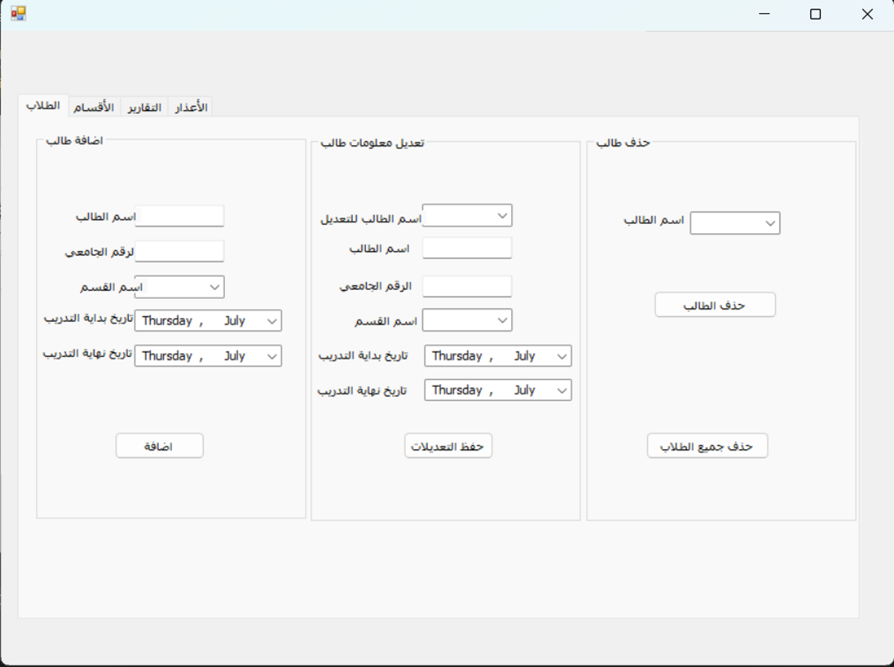
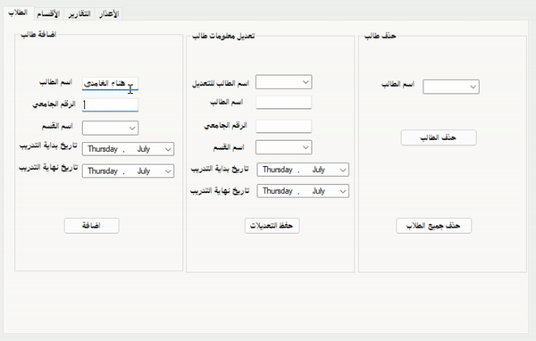
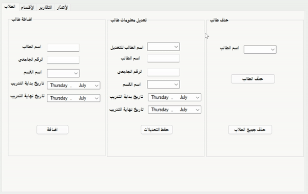
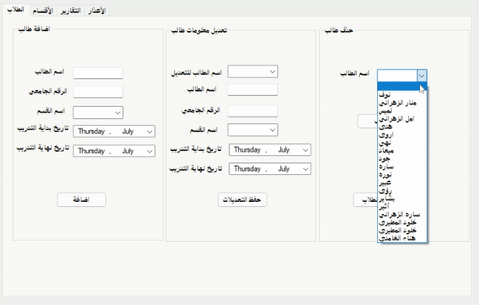
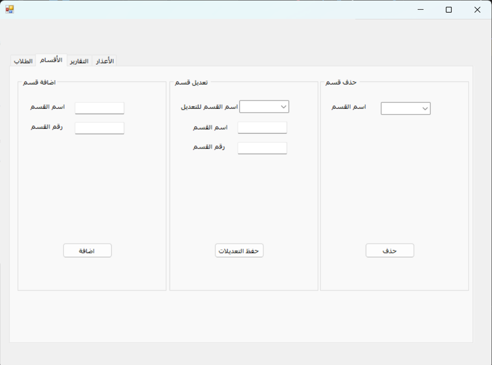
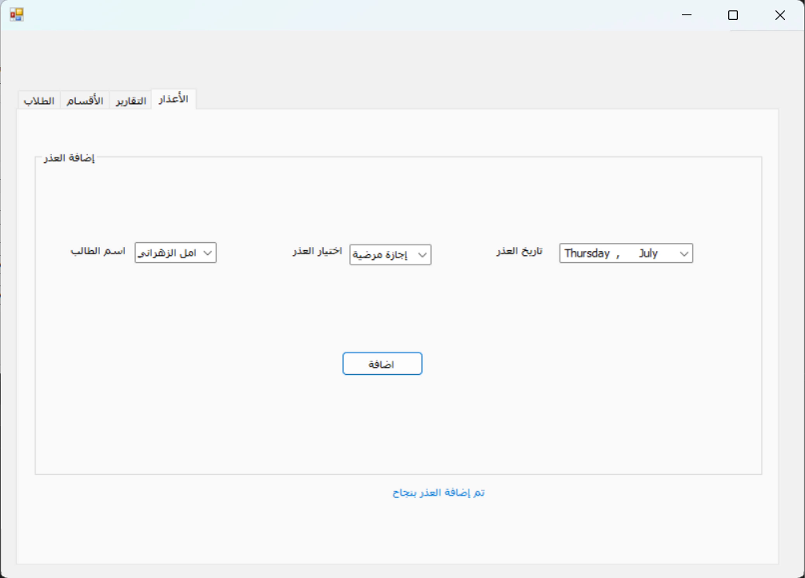
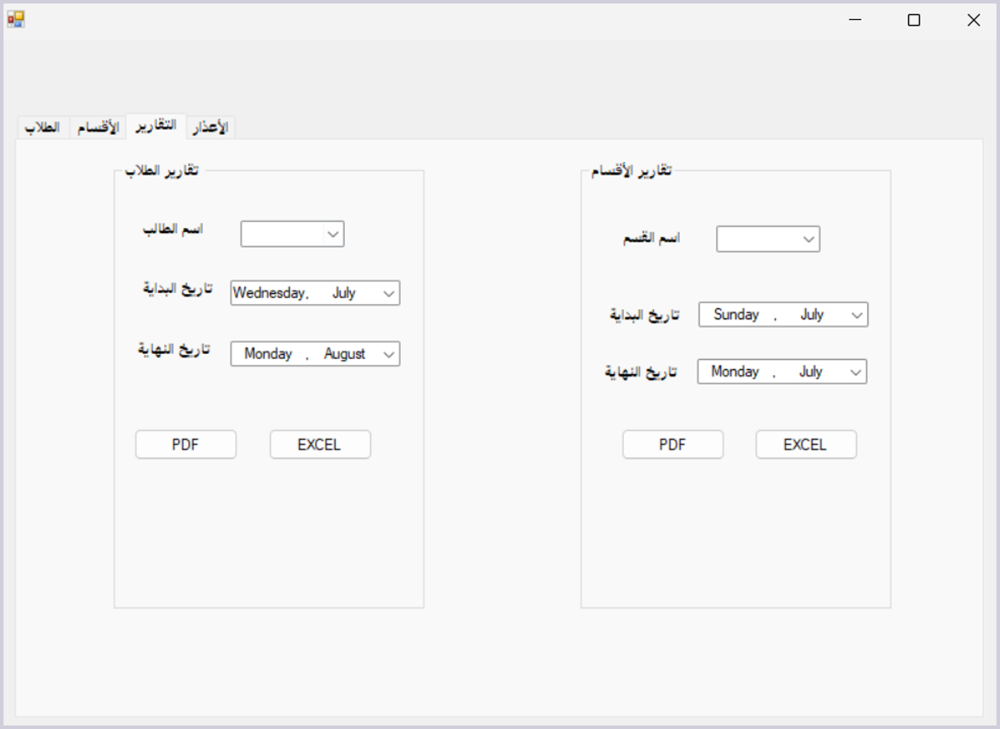
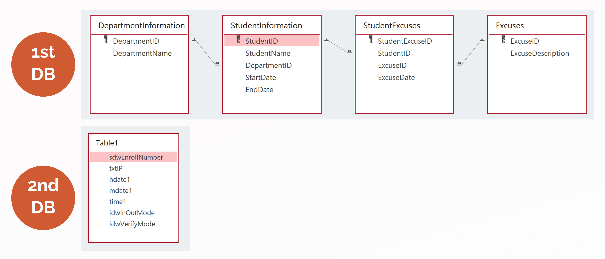

# Attendance Reporting System for Trainees


## 🚀 Project Overview
The **Attendance Reporting System** is a **desktop application** designed to streamline **trainee attendance management** by integrating with a **fingerprint scanner device**. Developed during my summer training at **General Administration of Information Technology (GAIT), King Abdulaziz University (KAU)**, this system automates attendance tracking, enhances **report generation**, and improves data accuracy.

## 🎯 Key Features
- ✅ **Automated Attendance Tracking:** Retrieves and processes fingerprint data to **log trainee entry and exit times**.
- ✅ **Detailed Report Generation:** Generates **attendance reports** for **specific students or departments** within a selected date range. Reports can be **exported in PDF or Excel format** and printed.
- ✅ **Comprehensive Data Management:** Allows adding, updating, and deleting **student and department records**.
- ✅ **Excuse Management:** Enables tracking and managing **student excuses** and **granted excuses**.
- ✅ **User Input Validation & Error Handling:** Ensures data integrity and prevents incorrect entries.

## 🛠️ Tech Stack
- **Programming Language:** C#
- **Framework:** .NET
- **Database:** Microsoft Access
- **File Export Formats:** Excel (XLSX), PDF

## 🔧 System Components
### 📌 Main Interfaces
The application consists of **four primary interfaces**, each facilitating essential functionality:

1️⃣ **Student Management Interface:**
- This interface allows administrators to **add, update, or delete student records** and assign students to specific departments.

<p align="center">  </p>
<p align="center" style="font-size: 10px; margin-bottom: 20px;"><strong>Student Management Interface</strong></p>
<br>
<p align="center">  </p>
<p align="center" style="font-size: smaller; margin-bottom: 20px;"><strong>Adding a Student</strong></p>
<br>

<p align="center">  </p>
<p align="center" style="font-size: smaller; margin-bottom: 20px;"><strong>Updating Student Information</strong></p>
<br>

<p align="center">  </p>
<p align="center" style="font-size: smaller; margin-bottom: 20px;"><strong>Deleting a Student</strong></p>
<br>

#### 2️⃣ Department Management Interface
- This interface enables administrators to **add, update, or delete department records**.
<p align="center">  </p>
<p align="center" style="font-size: smaller; margin-bottom: 20px;"><strong>Department Management Interface</strong></p>

#### 3️⃣ Excuse Management Interface
- This interface is used to **assign excuses for students within a specified date range**.
<p align="center">  </p>
<p align="center" style="font-size: smaller; margin-bottom: 20px;"><strong>Excuse Management Interface</strong></p>

#### 4️⃣ Attendance Reporting Interface
- The reporting interface allows administrators to:
   - **generate student-specific or department-wide attendance reports**
   - **Filter** attendance data by date range
   - Export reports in **PDF or Excel format**.
<p align="center">  </p>
<p align="center" style="font-size: smaller; margin-bottom: 20px;"><strong>Attendance Reporting Interface</strong></p>


### 📜 Attendance Reports
- 🔥 **Custom Reports:** Generate **attendance reports** for a specific student or an entire department within a selected date range.
- 📄 **Multiple Export Options:** Reports can be **exported** in **PDF and Excel formats** for further analysis.
- 📊 **Enhanced Data Insights:** Reports include **entry and exit times**, total attendance houres, and excuse details.

<p align="center">  </p>
<p align="center" style="font-size: smaller; margin-bottom: 20px;"><strong>Student Attendance Report</strong></p>

<p align="center">  </p>
<p align="center" style="font-size: smaller; margin-bottom: 20px;"><strong>Department Attendance Report</strong></p>

## 🗄️ Database Structure
The system utilizes **two databases** for efficient data management:

1️⃣ **Primary Database:**
   - Stores **student records, department information and excuses**.
   - Handles **data entry, updates, and deletions** for trainees and departments.
   
2️⃣ **Fingerprint Attendance Database:**
   - Retrieves **attendance logs** from the **fingerprint scanner device**.
   - Stores timestamped **records** for accurate attendance tracking.

<p align="center">
   
</p>
<p align="center" style="font-size: smaller; margin-bottom: 20px;"><strong>Database Structure</strong></p>


## 🚀 Getting Started
### 🔧 Installation & Setup
1️⃣ **Clone the repository:**
   ```sh
   git clone https://github.com/NuhaMakki/Attendance_Reporting_System.git
   ```
2️⃣ **Open the project in Visual Studio.**
3️⃣ **Configure the database:**
   - Replace the existing `.mdb` file in the `database` folder with your **fingerprint scanner database** (if needed).
4️⃣ **Run the application.**

## 🔍 Usage Guide
- 🏷️ **Track Attendance:** Connect the fingerprint scanner to **automatically log trainee attendance**.
- 📊 **Generate Reports:** Select a **date range** and export reports in **Excel or PDF**.
- 🏛️ **Manage Data:** Add, update, or remove **trainee and department records**.
- 📄 **Handle Excuses:** Review and approve **student absence excuses**.

## 🔮 Future Improvements
- Enhance the **user interface** for a more modern and intuitive experience.
- Implement **role-based access control** for different user levels.

## 📜 Conclusion
This system provides a **reliable, efficient, and automated** solution for **trainee attendance management**. By integrating **fingerprint authentication**, it eliminates manual errors and ensures **data accuracy**. The ability to **generate detailed reports** in multiple formats makes it a **powerful tool for administrators** overseeing student records.

## 📬 Connect with Me
If you have any questions or suggestions, feel free to connect!

<div align="center">

<a href="mailto:noha.m.makki@gmail.com" rel="nofollow">
  
</a>

<a href="https://www.linkedin.com/in/nuha-makki-a3b15a2b9/" rel="nofollow">
  
</a>

<a href="https://github.com/NuhaMakki" rel="nofollow">
  
</a>

</div>

